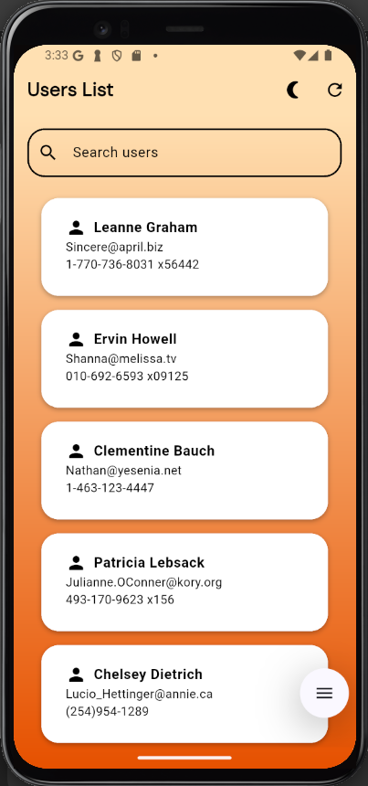
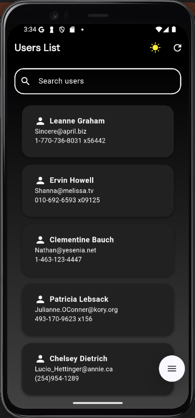
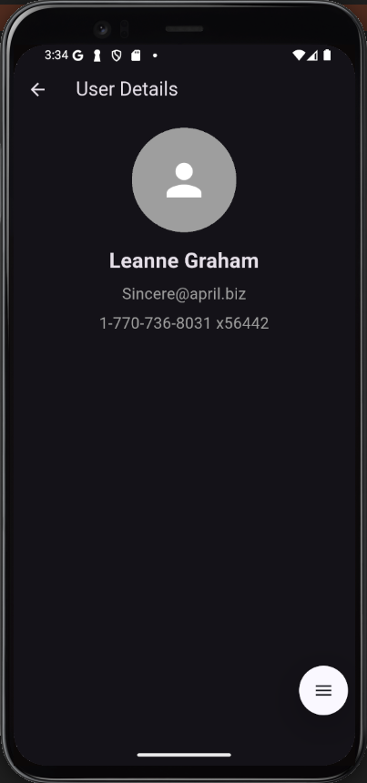

# 🚀 Flutter Portfolio App - Riverpod Challenge


> Challenge developed as part of my Flutter study journey, focusing on using **Riverpod** for state management, API integration, dynamic theme and real-time search.

---

## 📱 **App Demo**

| Home Screen Light Mode | Dark Theme Home Screen | User Details |
|:-------------:|:--------------------:|:-------------------------:|
|  |  |  |

---

## 🔥 **Features**

- ✅ List of users consuming API
- ✅ Search field with real-time filter
- ✅ Switch between light and dark theme ☀️🌙
- ✅ Manually reload data with button 🔄
- ✅ Custom Loading
- ✅ Navigation to user details
- ✅ State management with Riverpod
- ✅ Clean code organized by features

---

## 🏗️ **Project Structure**

lib/
├── models/ → Data models (User)
├── pages/ → Screens (Listing and Details)
├── providers/ → Riverpod providers
├── services/ → Service layer (API)
└── main.dart → Main file

---

## 🎯 **Technologies and Packages Used**

- ✅ Flutter
- ✅ Dart
- ✅ Riverpod → State Management
- ✅ Dio → HTTP Requests
- ✅ Gap → Spacing Widget
- ✅ Material Design

---

## 🚀 **How ​​to Run the Project**

1️⃣ Clone this repository:

```bash
git clone https://github.com/MachadoJorgeH/flutter_portfolio_riverpod.git
2️⃣ Access the project folder:

cd flutter_portfolio_riverpod

3️⃣ Install the dependencies:

flutter pub get

4️⃣ Run the app:

flutter run

🏆 Project Status
✔️ Project completed as Junior Level Challenge with Riverpod.
This project is part of my portfolio and is open for suggestions and improvements.